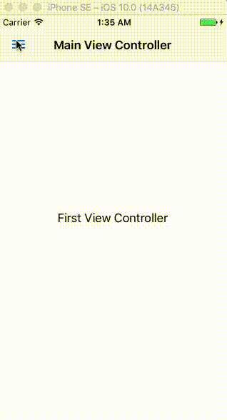

# SlideMenuControllerXamarin
Slide menu for Xamarin iOS. Based in [SlideMenuControllerSwift](https://github.com/dekatotoro/SlideMenuControllerSwift), created by [Yuji Hato](https://github.com/dekatotoro) 



##Installation
Install SlideMenuControllerXamarin from [NuGet](https://www.nuget.org/packages/SlideMenuControllerXamarin)

##Usage

###Setup
Add `using SlideMenuControllerXamarin`in your .cs file.

In the `AppDelegate.cs`:

```cs
public override bool FinishedLaunching(UIApplication application, NSDictionary launchOptions)
{

	//Create view controllers
	UIViewController mainControler = ... ;
	UIViewController leftController = ... ;
	UIViewController rightController = ...;


	SlideMenuController slideMenuController = new SlideMenuController(mainController, leftController, rightController);
	Window.RootViewController = slideMenuController;
	Window.MakeKeyAndVisible();
	return true;
}
```

###Custom options
Set custom properties before calling the init method:
```cs
SlideMenuOptions.LeftViewWidth = 50.0f;
SlideMenuOptions.ContentViewScale = 0.50f;
```

###Access from UIViewController

```cs
this.slideMenuController();
```

###Add navigation bar button

```cs
controller.AddLeftBarButtonWithImage(UIImage.FromBundle("menu"));
controller.AddRightBarButtonWithImage(UIImage.FromBundle("menu"));
```

###Open and close
```cs
controller.slideMenuController().OpenLeft();
controller.slideMenuController().CloseLeft();

controller.slideMenuController().OpenRight();
controller.slideMenuController().CloseRight();
```
## Creator
### SlideMenuControllerXamarin
[Bastián Véliz](https://github.com/bastianX6) 
[Web](http://www.bastianveliz.cl)

### SlideMenuControllerSwift
[Yuji Hato](https://github.com/dekatotoro) 
[Blog](http://buzzmemo.blogspot.jp/)

## License
SlideMenuControllerXamarin is available under the MIT license. See the [LICENSE](./LICENSE) file for more info.
